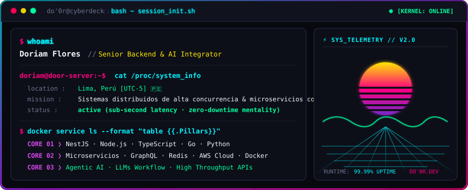
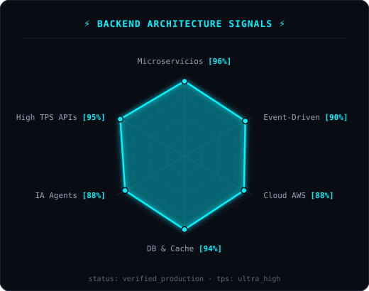
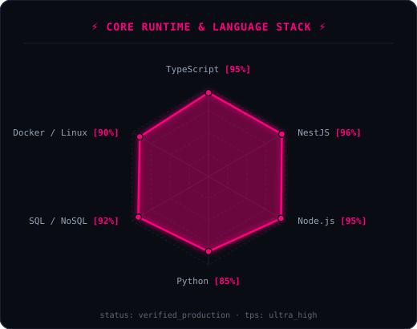

<!-- CYBERPUNK HEADER BANNER WITH ANIMATED TECH LOGOS & NEOVIM YAML (DARK/LIGHT SUPPORT) -->
<a href="https://doriamflores.github.io/doriamflores/">
  <picture>
    <source media="(prefers-color-scheme: dark)" srcset="assets/banner-dark.v4.svg">
    <source media="(prefers-color-scheme: light)" srcset="assets/banner-light.v4.svg">
    
  </picture>
</a>

  

<!-- CYBERPUNK ANIMATED TYPING BANNER -->

 

<!-- TELEMETRY BADGES -->
&nbsp;
&nbsp;
&nbsp;

---

## ⚡ `$ whoami`

  

 

## 👾 `$ cat tech-stack.yaml`

<table border="1" cellpadding="14" bgcolor="#0d0f18">
  <thead>
    <tr>
      <th colspan="2" align="left"><code>doriam@nightcity:~$ cat tech-stack.yaml</code></th>
    </tr>
  </thead>
  <tbody>
    <tr>
      <td width="50%" valign="top">
        <code>├─ ⚡ backend_core:</code>  
         
        <code>Node.js · NestJS · Express · TypeScript · Python · Go</code>
      </td>
      <td width="50%" valign="top">
        <code>├─ ▣ databases_cache:</code>  
         
        <code>PostgreSQL · MySQL · MongoDB · Redis (Cache &amp; PubSub)</code>
      </td>
    </tr>
    <tr>
      <td valign="top">
        <code>├─ 🤖 ai_agents_workflow:</code>  
        
        
        
         
        <code>OpenAI · LangChain · Claude · LLM Agents · Prompt Engineering</code>
      </td>
      <td valign="top">
        <code>├─ ☁ cloud_containers_devops:</code>  
         
        <code>AWS (EC2, Lambda, S3, SNS) · Docker · Linux · Nginx · Jenkins</code>
      </td>
    </tr>
    <tr>
      <td valign="top">
        <code>├─ 📡 architecture_messaging:</code>  
         
        <code>Microservicios · GraphQL Apollo · Kafka · RabbitMQ · WebSockets</code>
      </td>
      <td valign="top">
        <code>╰─ 🔒 security_standards:</code>  
        
        
         
        <code>Clean Architecture · SOLID · OWASP · JWT/RBAC · Swagger OpenAPI</code>
      </td>
    </tr>
  </tbody>
  <tfoot>
    <tr>
      <td colspan="2"><code>status: ready_for_production&nbsp;&nbsp;·&nbsp;&nbsp;environment: distributed_cluster&nbsp;&nbsp;·&nbsp;&nbsp;latency: sub_second</code></td>
    </tr>
  </tfoot>
</table>

---

## 📡 `$ sysctl --telemetry-radars`

<table align="center" border="0" cellpadding="0" cellspacing="0" style="border: none; background: transparent;">
  <tbody style="border: none; background: transparent;">
    <tr style="border: none; background: transparent;">
      <td align="center" valign="middle" style="border: none; padding: 0 8px; background: transparent;">
        <picture>
          <source media="(prefers-color-scheme: dark)" srcset="assets/radar-backend-dark.v3.svg">
          <source media="(prefers-color-scheme: light)" srcset="assets/radar-backend-light.v3.svg">
          
        </picture>
      </td>
      <td align="center" valign="middle" style="border: none; padding: 0 8px; background: transparent;">
        <picture>
          <source media="(prefers-color-scheme: dark)" srcset="assets/radar-stack-dark.v3.svg">
          <source media="(prefers-color-scheme: light)" srcset="assets/radar-stack-light.v3.svg">
          
        </picture>
      </td>
    </tr>
  </tbody>
</table>

  <code>signals: backend_architecture_radar · runtime_stack_radar · status: healthy [zero_packet_loss]</code>

---

## 🔌 `$ connect --socials`

&nbsp;&nbsp;
&nbsp;&nbsp;
&nbsp;&nbsp;

  

Hecho con mucha cafeína y ❤️

